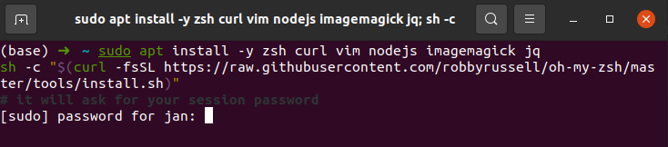

# Setup instructions

The following instructions will help you to get ready for [Strive School](https://strive.school/) 6 intense months!
- Creating a github Account
- Grab a decent text editor
- Setup git and GitHub
- Pimp your Terminal
- Install Anaconda
- Install Jupyter Notebooks
- Pick an IDE


## GitHub account

Have you signed up to GitHub? If not, [do it right away](https://github.com/join).

:point_right: **[Upload a picture](https://github.com/settings/profile)** and put your name correctly on your GitHub account. This is important for several reasons: 
- employability
- in case we use an internal dashboard with your avatars. --> WE DO!
 
Please do it **now**.


## Sublime Text 3 - Your text editor

A text editor is one of the most important tools of a developer. This doesn't necessarly have to be yours, since you can pick between this, and IDE and something on the web like Jupyter notebooks. Nevertheless, great asset to have installed just in case. u
Follow these instructions in the Terminal:

```bash
wget -qO - https://download.sublimetext.com/sublimehq-pub.gpg | sudo apt-key add -
```

:point_up: This command will ask for your password with: `[sudo] password for <username>:`. Don't panick! Calmy type your password key by key. You won't have a visual feedback (like little `*`), that's **perfectly normal**, keep on typing. When you're done, hit `Enter` :muscle:.

```bash
sudo apt install -y apt-transport-https
echo "deb https://download.sublimetext.com/ apt/stable/" | sudo tee /etc/apt/sources.list.d/sublime-text.list
sudo apt update
sudo apt install -y sublime-text
```

Sublime Text is free without any time limitation but a popup will appear every ten saves to remind you there is a license to buy. You can hit `Esc` when this happens, but feel free to buy Sublime Text if you really like this one (there are alternatives).

## Git

To install `git`, first open a terminal. To open a terminal, you can click on the Ubuntu Start button in the sidebar and type `Terminal`. Then click on the terminal icon.

Then copy this line with `Ctrl` + `C`:

```bash
sudo apt install -y git
```

:bulb: To **paste it in the terminal**, you need to use `Ctrl` + `Shift` + `V`.

Verify the installation was successful by typing `which git --version`:

```$ git --version git version 2.9.2```

You have git connected to github (the website). You can verify that by typing in the terminal:
```git```
or
```git help -a```

## Oh-my-zsh - Fancy your Terminal

We will use the shell named `zsh` instead of `bash`, the default one.

```bash
sudo apt install -y zsh curl vim nodejs imagemagick jq
sh -c "$(curl -fsSL https://raw.githubusercontent.com/robbyrussell/oh-my-zsh/master/tools/install.sh)"
# it will ask for your session password
```

Be careful, those commands will ask you to **type your password twice**. At the end
your prompt should look like this:



If it doesn't, **ask a facilitator or search the error online!**. It should be your regular ubuntu password. Type it and **let it install**. 

To make this change stick, **restart your laptop** (or virtual machine):

```bash
sudo reboot
```

Once the installation is done, you can verify the Zsh version by running the following command;

```zsh --version
zsh 5.4.2 (x86_64-ubuntu-linux-gnu)
```

## Configure Zsh

Now that Zsh in installed, make it your default shell by running the command below;

```
chsh -s $(which zsh)
```
This will the default shell for the current user. If run sudo `chsh -s $(which zsh)` it will change the default shell for root.
If this doesn't work, **let us know** and we will come sort it out manually :) 

At any time, you can switch between `bash` and `zsh` by typing `exec bash` or `exec zsh`. Not important for now. 

### Syntax Highlighting
You want Zsh syntax highlighting. It will tell you **if your command is valid even before you run it**. It’s handy.

To enable syntax highlighting, run
```
cd ~/.oh-my-zsh 
git clone https://github.com/zsh-users/zsh-syntax-highlighting.git
echo "source ${(q-)PWD}/zsh-syntax-highlighting/zsh-syntax-highlighting.zsh" >> ${ZDOTDIR:-$HOME}/.zshrc
```
and then enable it by running
```
source ~/.oh-my-zsh/zsh-syntax-highlighting/zsh-syntax-highlighting.zsh
```
If `git` is not installed, download and extract a snapshot of the latest development tree from:
```
https://github.com/zsh-users/zsh-syntax-highlighting/archive/master.tar.gz
```

Restart your terminal for your changes to take effect.

### Add ZSH-AutoSuggestion Plugin

This plugin auto suggests any of the previous commands. Pretty handy! **To select the completion, simply press → key.**

1.     Install the plugin
`git clone https://github.com/zsh-users/zsh-autosuggestions $ZSH_CUSTOM/plugins/zsh-autosuggestions`

2. Open `~/.zshrc` and add `zsh-autosuggestions` in the plugins section

3. and then enable it by running
```
source ~/.zshrc
```

### Sublime text

By adding sublime to the plugin list, you will be able to launch it with a simple `stt` command in the terminal

### BONUS: Customize your Terminal Theme
Many options and settings to [choose from!](https://www.freecodecamp.org/news/how-to-configure-your-macos-terminal-with-zsh-like-a-pro-c0ab3f3c1156/)

You can check how they look like [here](https://github.com/ohmyzsh/ohmyzsh/wiki/Themes)

### BONUS: Look and install other useful packages
-This is a list of [all the oh-my-zsh plugins](https://github.com/ohmyzsh/ohmyzsh/wiki/Plugins)
-It is probably worth checking the [most useful one's only :)](https://safjan.com/top-popular-zsh-plugins-on-github/)

Am example of interesting plugins one could have in the `~/.zshrc` config file. If you want to modify it directly, you can also use sublime for it (if you have the package installed) `subl ~/.zshrc` --> edit the text, save, close and then enable it by running `source ~/.zshrc`

```
# Useful oh-my-zsh plugins
plugins=(git gitfast last-working-dir common-aliases sublime zsh-syntax-highlighting history-substring-search zsh-autosuggestions git-flow-completion)
```

## GitHub

Github is the place where all developers upload their code. Kind of like a Dropbox of code. But it does much more than that. For the moment. Just installing it should be enough. 

First, sign up for github if you don't have an account already (2nd warning!). [Sign UP](https://github.com) 

There are two ways in which you talk to Github in the web from your computer:
- Directly from the terminal
- Using an application such as github desktop

BAD and GOOD news:
- BAD: No direct github desktop for ubuntu
- GOOD: You will become a better developer as a result of using the terminal

## Making your Git <--> Github flow easy

If you remember from before, we have git connected with the website (github.com).  

The thing is... how does github know who we are? What if we want to work in a **super secret project**?


We can configure your Git username and email using the following commands, replacing Elon's name with your own. 
These details will be associated with any commits that you create:

```$ git config --global user.name "Elon Musk"```
```$ git config --global user.email "elon@tesla.com"```

Now, github is connected with your account, you can verify that by typing:
```git config --list```, which will list the settings. There you should also find `user.name` and `user.email`.

HTTPS is the one applied by default. Basically, every time you try to upload something, it will ask you for the email and password, even if it knows who you are. 
SSH is similar to when you wanna always be **logged in to your email**. You create a key that tells github that this computer is always safe. 

Here is an article explaining the differences [1](https://git-scm.com/book/en/v2/Git-on-the-Server-The-Protocols) [2](https://serverfault.com/questions/832899/difference-between-https-git-clone-and-ssh-git-clone)

We need to generate SSH keys which are going to be used by GitHub and Heroku
to authenticate you automatically. Think of it as a way to log in, but different from the
well known username/password couple. If you already generated keys
that you already use with other services, you can skip this step.

Open a terminal and type this, replacing the email with **yours** (the
same one you used to create your GitHub account). It will prompt
for information. Just press enter until it asks for a **passphrase**.

```bash
mkdir -p ~/.ssh && ssh-keygen -t ed25519 -o -a 100 -f ~/.ssh/id_ed25519 -C "TYPE_YOUR_EMAIL@HERE.com"
```

**NB:** when asked for a passphrase, put something you want (and that you'll remember),
it's a password to protect your private key stored on your hard drive. You'll type,
nothing will show up on the screen, **that's normal**. Just type the passphrase,
and when you're done, press `Enter`.

Then you need to give your **public** key to GitHub. Run:

```bash
cat ~/.ssh/id_ed25519.pub
```

It will prompt on the screen the content of the `id_ed25519.pub` file. Copy that text,
then go to [github.com/settings/ssh](https://github.com/settings/ssh). Click on
**Add SSH key**, fill in the Title with your computer name, and paste the **Key**.
Finish by clicking on the **Add key** green button.

To check that this step is completed, in the terminal run this. **You will be
prompted a warning**, type `yes` then `Enter`.

```bash
ssh -T git@github.com
```

If you see something like this, you're done!

```bash
# Hi --------! You've successfully authenticated, but GitHub does not provide shell access
```

If it does not work, try running this before trying again the `ssh -T` command:

```bash
ssh-add ~/.ssh/id_ed25519
```

Don't be in a rush, take time to [read this article](https://developer.github.com/v3/guides/managing-deploy-keys/) to get a better understanding of what those keys are used for or follow [this tutorial](https://help.github.com/en/articles/connecting-to-github-with-ssh) for a more detailed step-by-step guide. 

## Package checker

You can download a package checker script in this [link](https://github.com/Strive-School/ai_setup/blob/master/checker_script.sh).

Once you have downloaded it to run it simply open a terminal in where the file is and type ``` bash checker_script.sh```.

If everything goes correctly you should see an outcome similar to the following:

```
code/stable,now 1.54.3-1615806378 amd64 [installed]
git/focal-security,now 1:2.25.1-1ubuntu3.1 amd64 [installed]
python3/focal,now 3.8.2-0ubuntu2 amd64 [installed,automatic]
zsh/focal,now 5.8-3ubuntu1 amd64 [installed]
conda 4.9.2
Sublime Text Build 3211
pycharm-community: /snap/bin/pycharm-community

```

We hace compiled an executable file in order for you to check if you have correctly installed all the neccesary packages in ubuntu. In order to use it follow the instructions below.

1.- Follow this [link](https://github.com/Strive-School/ai_setup/blob/master/package_checker_ubuntu) to the file.

2.- On the right hand side of the page you should see a download buttom, click it and download the file to your machine.

3.- Next thing you need to do is to open the folder where the file is located. There are two ways of doing this.

  Manual: Right click the downloaded file and slect 'open in folder', this should open the folder where the file is located. Now right click in a blanc space    of the folder and select the 'Open In Terminal' option. Now you have a terminal opened on the same folder as the file.
  
  Console: you can use the ``` cd path``` command to move through the file system until you arrive to the folder where the file has been saved. for example 
  ``` cd /home/jon/Downloads```.
  
4.- Once you have a terminal opened in the folder you can simple type ```./package_checker_ubuntu``` and if everything went correctly you should see something like this :

```bash
Welcome to the Strive School package checker: 

The following packages are missing: 

anaconda  

sublime  

pycharm-educational 

```

You can also execute the file from anywhere if you know the path to the file:
```bash
./Strive/dist/package_checker_ubuntu 
```


## Discord

[Install Discord for Ubuntu](https://discord.com/download).

Add your first name and last name (we cannot search by email)

Make sure you upload a picture there as well.

You can also sign in to Discord on your iPhone or Android device!

The idea is that you'll have Discord open all day, so that you can share useful links / ask for help / decide where to go to lunch / etc.

## Installing Anaconda and Jupyter Notebook
Okay, no more step by step guides now! Can you follow the official tutorial by Anaconda?
[Install Anaconda here](https://docs.anaconda.com/anaconda/install/linux/)

## Install Jupyter Notebook Extensions

Open a terminal with anaconda using your custom environment and run
`conda install -c conda-forge jupyter_nbextensions_configurator`.

Then enables it by running `jupyter nbextensions_configurator enable --user` in the same terminal.

Open a jupyter notebook and you should see the following:
 that is another tab beyond Files, Running and Clusters named Nbextensions. Click on it, then uncheck "disable configuration for extensions without explicit..." and choose the ones you prefer.

[Here](https://www.loom.com/share/285ec5ee08f04b0cbab05f3ea519acef) a quick loom on how to enable some of the available extensions.


## Guide to install Cuda for Linux
If you have a NVIDIA GTX or RTX card that is cuda ready and you want to enhance your performance in PyTorch or tensorflow,learn how to install cuda in Ubuntu,
[Follow this tutorial ](https://medium.com/analytics-vidhya/installing-tensorflow-with-cuda-cudnn-gpu-support-on-ubuntu-20-04-f6f67745750a)

## Something missing?
Open an issue or add your own contribution!!

**Time to Strive**
